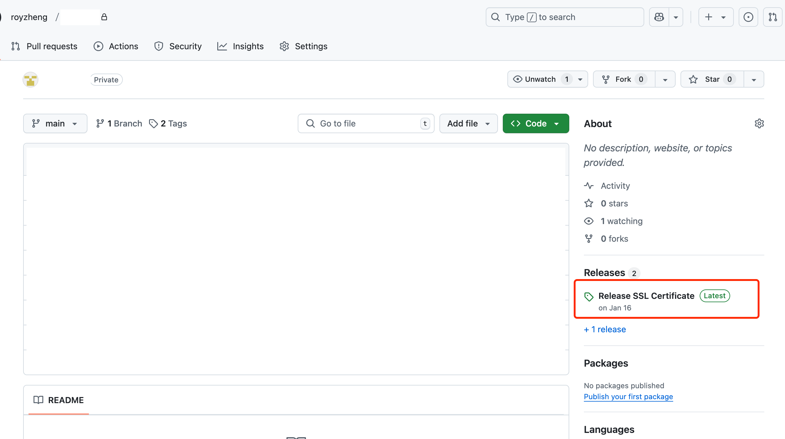
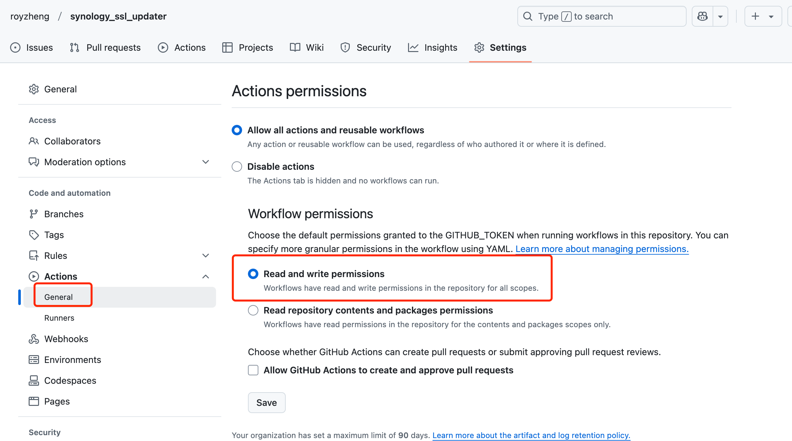
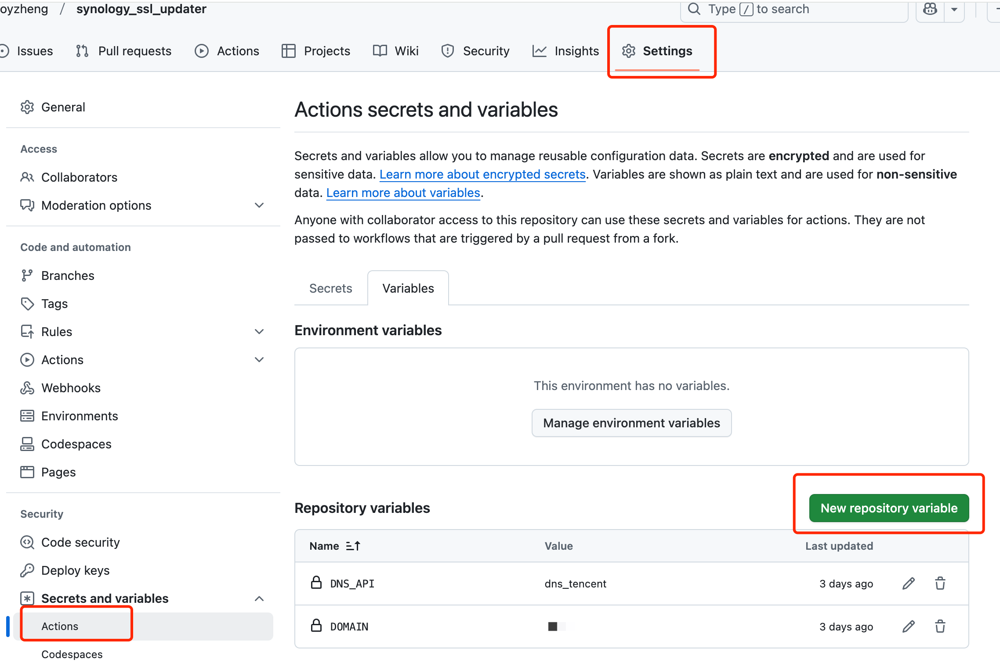
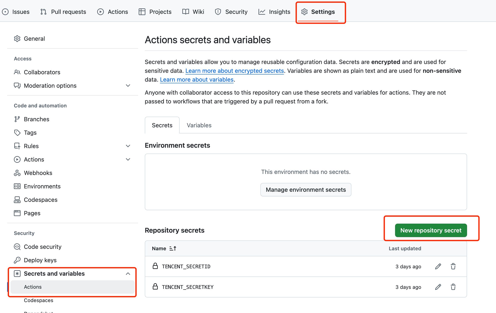
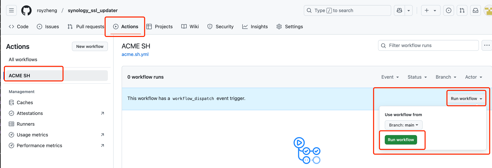
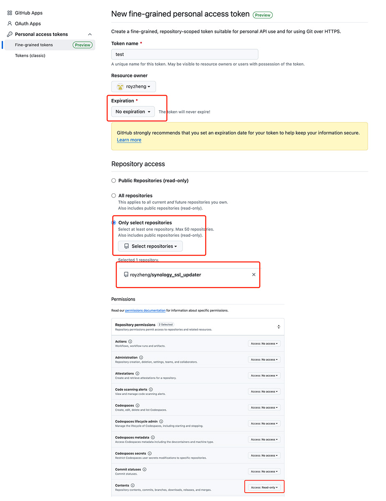
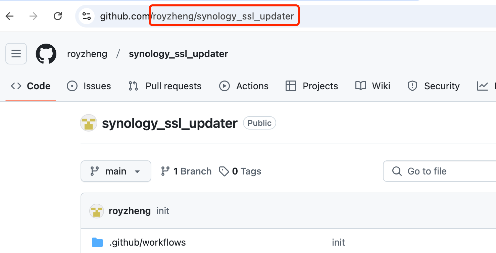
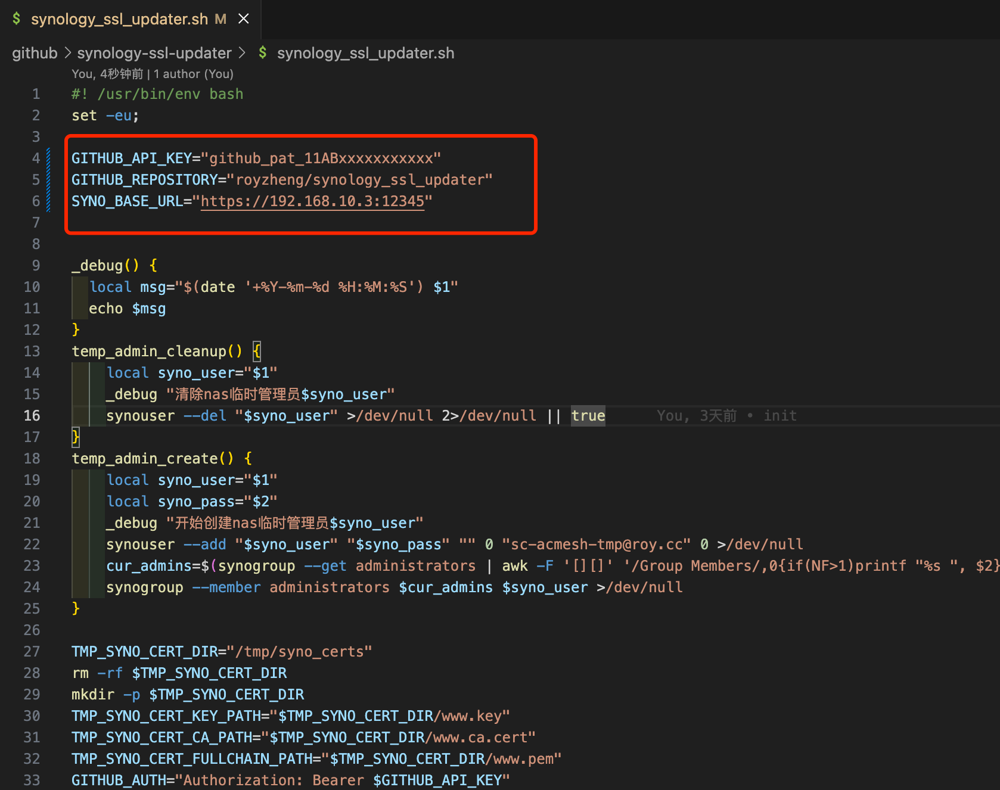
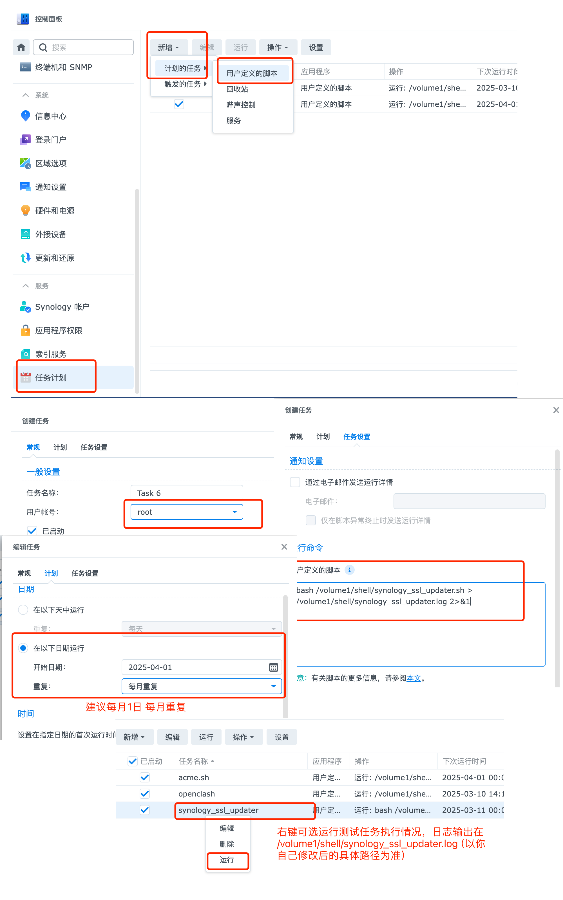

# 群晖 SSL 证书自动更新助手

## 概述

❗️❗️❗️**不要使用fork功能，使用Import Repository功能才能方便让你的项目设置为私有(当然你有git知识不用理会此条)**

本项目利用 [acme.sh](https://github.com/acmesh-official/acme.sh/wiki/dnsapi) 的 DNS API 申请 SSL 证书，并在 GitHub Actions 下执行，最终将证书发布到 GitHub Release 上。

为了使用此项目，请通过 GitHub 的 **[Import Repository](https://github.com/new/import)** 功能将本项目导入到你自己的仓库，并将仓库设置为 **私有**。

此外，本项目还提供了一个用于群晖系统的 **更新证书脚本**。请将脚本下载并上传到你的群晖系统中，然后设置定时任务执行。

---

## 项目设置

### 1. 配置 GitHub Actions 权限

在 GitHub 仓库设置中，前往以下路径，确保设置为 **Read and write permissions**：

```
Settings -> Code and automation -> Actions -> General -> Workflow permissions
```


### 2. 添加仓库变量

在 GitHub 仓库设置中，前往以下路径，添加以下 **Variables**：
```
Settings -> Security -> Secrets and variables -> Variables
```

- `DOMAIN`：要申请的域名（例如：`abc.com`, 指定填写你拥有的顶级域名即可，会自动申请泛域名证书，即该证书可适用于abc.com以及*.abc.com）
- `DNS_API`：要使用的 DNS API 名称（例如：`dns_cf`，详见下方的对照表）



### 3. 添加 Secrets

在 GitHub 仓库设置中，前往以下路径，按照下方表格中的需求添加 **Secrets**：
```
Settings -> Security -> Secrets and variables -> Secrets
```

---

## DNS API 对照表

| **描述**        | **DNS_API**   | **需要导入的 Secrets(不区分大小写)**              |
|-----------------|---------------|-------------------------------------|
| **Cloudflare DNS**  | `dns_cf`      | `CF_Account_ID`, `CF_Zone_ID`, `CF_Token` |
| **阿里云 DNS**      | `dns_ali`     | `Ali_Key`, `Ali_Secret`             |
| **DNSPod**          | `dns_dp`      | `DP_Id`, `DP_Key`                  |
| **腾讯云 DNS**      | `dns_tencent` | `Tencent_SecretId`, `Tencent_SecretKey` |

> **提示**: 上面的对照表仅列出本项目支持的 DNS API。如果你希望使用其他 DNS API，请参考 [acme.sh DNS API 文档](https://github.com/acmesh-official/acme.sh/wiki/dnsapi)，并根据需要修改代码以进行支持。

### 一切都设置完毕，可以去actions里手动触发看看能不能成功申请证书了


> **提示**: 定时任务是1,3,5,7,9,11月的30号执行，具体可以看acme.sh.yml里schedule/cron

---
# synology_ssl_updater.sh脚本使用说明

## 使用说明
### 下载synology_ssl_updater.sh到nas里
### 修改synology_ssl_updater.sh里的变量
* GITHUB_API_KEY 前往以下路径 **[Settings](https://github.com/settings/profile) -> Development Settings -> Personal access tokens -> Fine-grained tokens -> Generate new token**申请，选择Only select repositories里选择你的项目，Repository permissions里Contents赋予Read only权限

* GITHUB_REPOSITORY 比如本项目是royzheng/synology-ssl-updater，你自己的项目根据你的信息填写

* SYNO_BASE_URL 比如你群晖内网ip是192.168.10.3，https的端口是12345，就填写https://192.168.10.3:12345

### 定时任务执行
* 在群晖里，**设置 -> 计划任务 -> 新增 -> 计划的任务 -> 用户自定义脚本**
* 用户账户选用**root**,任务设置处用户自定义的脚本填写, 其中/volume1/shell请替换成你实际存储的位置
```
bash /volume1/shell/synology_ssl_updater.sh > /volume1/shell/synology_ssl_updater.log 2>&1
```
* 建议设置为每月1日运行，设置完后可以右键任务并点运行，看看效果
